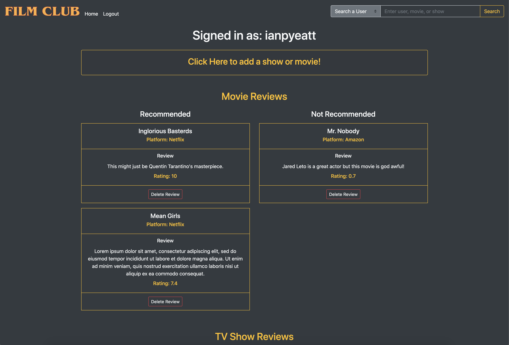

# Film Club

## Description

Film Club is an app with the goal to facilitate people's passion for movies and shows! Users are able to log their reviews of movies and shows, search other user's pages, and search all reviews of a particular movie or show they are interested in.

## Collaborators

- [Aaron Tobey's Github](https://github.com/abtobey)
- [Ian Pyeatt's Github](https://github.com/pyeatti)

## Deployed Site

[Film-Club-App](https://film-club-ian-aaron.herokuapp.com/)

## New Technology

anime.js - we used this to added dynamic features to some of our html elements on the login, sign up, and user page.

## Required Installs

- npm install sequelize
- npm install mysql2
- npm install moment
- npm install passport
- npm install passport-local
- npm install bycrpytjs
- npm install express
- npm install express-session
- npm install express-handlebars
- npm install animejs

## Screenshot (WIP)

